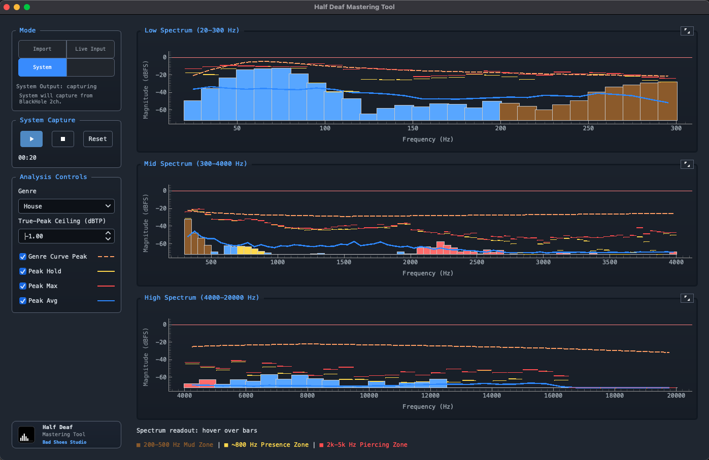

# Half Deaf Mastering Tool

[](https://www.python.org/downloads/)
[](https://github.com/scott-patek/hd_mt/releases)
[](LICENSE)

Python desktop app for objective mastering guidance with strong low-end safety checks.



## Website

Project site (GitHub Pages):

- https://scott-patek.github.io/hd_mt/
- Source: `docs/index.html`

## License and Security

- License: MIT ([LICENSE](LICENSE))
- Security policy: [SECURITY.md](SECURITY.md)

## Features
- Audio/video file loading from picker (WAV/MP3 and MP4/MOV support).
- Real-time playback, seek, and timing.
- Spectrum analyzer (log-frequency bars) + spectrogram.
- Peak hold, 0 dBFS line, clipping warnings.
- LUFS (integrated/short-term/momentary), sample peak, true peak, stereo correlation/width.
- Low-end diagnostics for Sub (20-60 Hz), Bass (60-120 Hz), Low-mid (120-350 Hz).
- Continuous coaching and manual Analyze report with trend history.
- Optional reference track with level-matched A/B comparison.
- System Output mode for listening to computer playback through a loopback-capable audio device.

## Prerequisites

**Release installers (DMG/EXE):** macOS 11+ or Windows 10/11 (64-bit).

**Running from source:** Python 3.11+ — [Download](https://www.python.org/downloads/) if needed.

**ffmpeg:** Required for video files (MP4/MOV/MKV/M4V) and fallback decoding of some audio files.
Recommended for all installs. Release installers do not bundle ffmpeg, so install it on your PATH:

- **macOS:** `brew install ffmpeg`
- **Windows:** `winget install ffmpeg` (or `choco install ffmpeg`)
- **Linux:** `apt install ffmpeg` (or equivalent)

## Quick Start

### macOS / Linux
```bash
python3 run.py
```

Or make it executable once:
```bash
chmod +x run
./run
```

### Windows
```powershell
python run.py
```

Or double-click `run.bat` in File Explorer.

## System Output mode

When you choose System Output, the app listens to a loopback-capable input instead of a microphone.

- **macOS:** install BlackHole, then route output through a Multi-Output Device that includes both BlackHole and your speakers/headphones.
- **Windows:** use Stereo Mix or another driver-provided loopback input if your audio device exposes one.
- The launcher prints the platform-specific setup hint before opening the app.

### macOS BlackHole setup (recommended)

Use this to analyze browser/app playback in System mode.

1. Install BlackHole 2ch:
	- `brew install --cask blackhole-2ch`
	- Or install from the BlackHole project website if you prefer a manual installer.
2. Open **Audio MIDI Setup** (Applications > Utilities).
3. Click the **+** button at bottom-left, then choose **Create Multi-Output Device**.
4. In the right panel, enable both:
	- **BlackHole 2ch**
	- Your physical output (**Mac Speakers**, headphones, or audio interface)
5. Optionally enable **Drift Correction** for the non-clock device if you hear timing drift.
6. In macOS sound output settings, choose the new **Multi-Output Device**.
7. In this app, choose **System** mode.

Important behavior:
- If macOS output is set to **BlackHole only**, you will capture audio but hear silence.
- If macOS output is set to the **Multi-Output Device**, audio is duplicated: you hear it and the app captures it.
- When finished using System mode, switch macOS output back to your normal speakers/headphones if desired.

---

## What the launcher does
1. Creates/activates `.venv` (virtual environment)
2. Installs Python dependencies from `requirements.txt`
3. Verifies ffmpeg is available
4. Launches the app from source

## Testing
```bash
# Create/activate venv and run tests
python3 run.py --test

# Or manually:
python3 -m venv .venv
source .venv/bin/activate  # macOS/Linux: .venv\Scripts\activate on Windows
pip install -r requirements.txt
pytest tests/ -q
```

## Deployment and versioning

Release/versioning workflow and packaging commands now live in [deployment.md](deployment.md).
